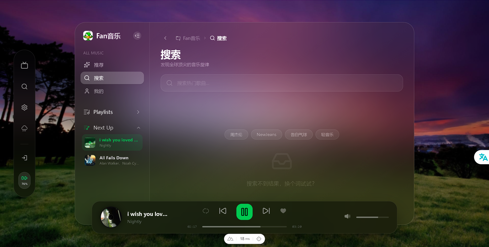
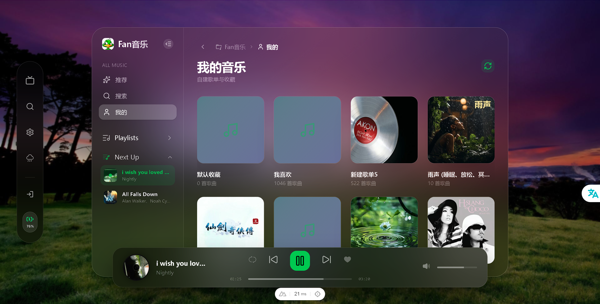

# fanMusic

一个基于 **Nuxt 4** 开发的个人音乐站点，采用酷狗概念版 API 驱动。界面设计灵感来源于 Apple Music，旨在提供极致、纯净的听歌体验。


## ✨ 特性

- **🎵 极致体验**: 深度复现 Apple Music 的视觉审美，简洁而不失高级感。
- **🔍 全能搜索**: 支持搜索歌曲、歌手、专辑，快速找到你心仪的旋律。
- **🎧 智能播放**:
  - 支持 **播放队列** 管理，自由调整播放顺序。
  - 多种播放模式：列表循环、顺序播放、随机播放、单曲循环。
  - 支持音量调节及状态保存。
- **📅 发现音乐**: 集成每日推荐、热门歌单等功能。
- **💾 数据持久化**: 自动保存播放队列、当前播放进度及个人偏好设置。
- **🚀 技术先进**: 使用 Nuxt 4、Pinia、Tailwind CSS、Nuxt UI 等现代前端技术栈。

## 🛠️ 技术栈

- **框架**: [Nuxt 4](https://nuxt.com/)
- **界面**: [Nuxt UI](https://ui.nuxt.com/) & [Tailwind CSS](https://tailwindcss.com/)
- **状态管理**: [Pinia](https://pinia.vuejs.org/)
- **图标**: [Iconify](https://iconify.design/)
- **工具库**: [VueUse](https://vueuse.org/)
- **持久化**: [pinia-plugin-persistedstate](https://prazdevs.github.io/pinia-plugin-persistedstate/)

## 🏗️ 快速开始

### 环境依赖

- Node.js (v20.0.0+)
- pnpm (推荐)

### 安装 & 运行

1.  **克隆项目**

    ```bash
    git clone https://github.com/your-username/fanMusic.git
    cd fanMusic
    ```

2.  **安装依赖**

    ```bash
    pnpm install
    ```

3.  **配置环境**
    在根目录创建 `.env` 文件并配置酷狗 API 源：
    ```env
    # 酷狗概念版 API 源 (私有配置)
    NUXT_API_KUGOU_API_SOURCE=your_kugou_api_url
    ```

4.  **启动开发服务器**

    ```bash
    pnpm dev
    ```

5.  **构建生产版本**
    ```bash
    pnpm build
    pnpm preview
    ```

## 📸 项目截图

| 首页推荐             | 搜索界面             | 播放详情             |
| :------------------- | :------------------- | :------------------- |
|  |  |  |

## ⚖️ 声明

本项目仅供个人学习及研究使用。音乐版权归原平台（酷狗音乐）所有，请勿用于任何商业用途。

---

Made with ❤️ by [fanMusic Team]
